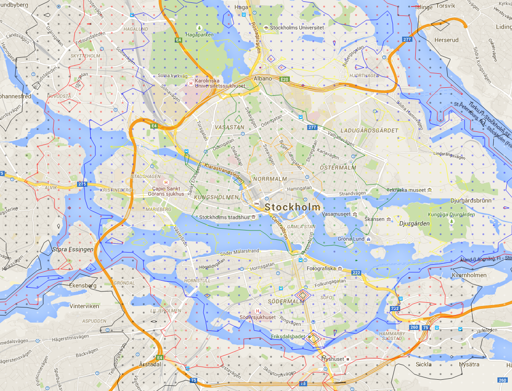

# isobike
A simple program that displays isocurves in the scalar bike-time field of Stockholm. In other words - it tells you how long it takes to ride a bike from a specific point in central Stockhoml to several areas. 

To use the code - just open the index.html on a local web server. Since it fetches extra data (the geojson-files) using AJAX, you need to have a running web server. I normally use "python -m SimpleHTTPServer" since it is easy and does the trick.

If you want to edit the data shown, look at the fetcher.py and curvefinder.py. They download a gridded data set from the google distance matrix and compute the level sets respectively. Their output is stored in GeoJSON files in the database subdirectory.

To edit the styling of the data - take a look at the map_loader.js. It is the java script that loads the google map, mounts the data and styles it.

When working properly, it looks like this: 
